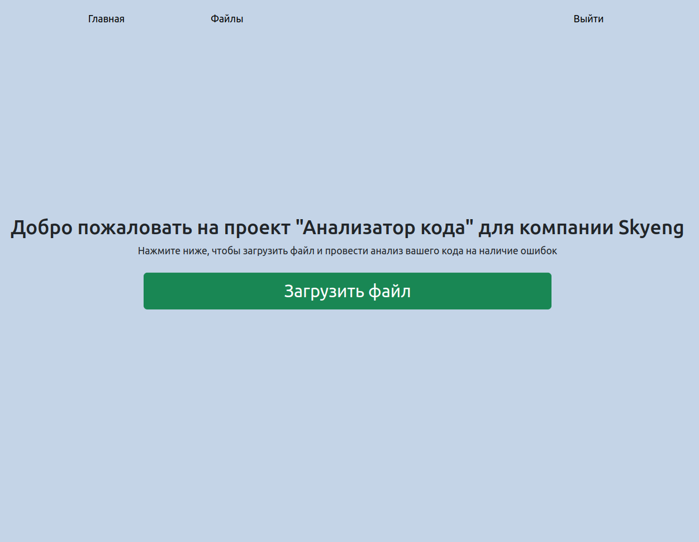
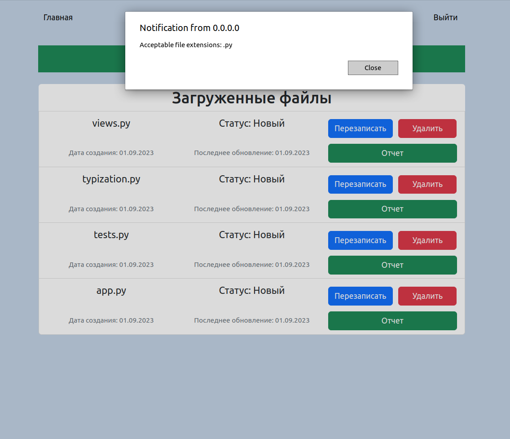

# <div align="center">Django Линтер📁</div>

<div align="center">

</div>

<br/>
Идея для проекта была дана команией Skyeng в качестве тестового задания. Во время выполнения проекта я использовал современные стандарты и технологии. Благодаря этому заданию я повторил знания об фреймворке Django и язык JavaScript 

## Description

<div align="center">

</div>
<br/>

> Нужно повысить качество передаваемого кода на ревью, чтобы ускорить процесс разработки и поставки более качественного
> кода в проекты. Для этого создайте сервис проверки файлов с выполненными задачами.
> 1. Интерфейс системы должен содержать следующие экраны: вход, регистрация, список загруженных файлов, отчет проверки
     по каждому файлу отдельно, изменение файла, удаление файла
> 2. Реализованы все 5 модулей
> 3. Для разных сервисов созданы отдельные контейнеры (django, postgresql, redis, celery, при необходимости список можно
     самостоятельно расширять), все оформлено в docker-compose файле, при необходимости можно создавать вспомогательные
     Dockerfile
> 4. Проект готов быть размещен на удаленном сервере
> 5. Интерфейс понятен и соответствует базовым требованиям системы
> 6. Решение выложено на github.com

Этот проект - полноценный линтер файлов, реализованный на базе фреймфорка Django. Здесь вы можете добавить файл или
перезаписать его, и сервер в автоматическом режиме запустит проверку кода общепринятым правилам с помощью линтера
Pylinter в асинхронном режиме . Вы всегда можете посмотреть отчет об каждом файле (кроме удаленных файлов). После каждой
новой проверки на ваш
email придет отчет о результатах. Я реализовал требуемый функционал, а также функционал с протоколом WebSocket для
обновления данных в режиме реального времени

## Technologies

***Language***


***Framework***


***Databases***


***Libraries***


***Other***


В первую очередь мне предстояла задача изменить бэкенд аутентификации пользователя и сделать регистрацию и авторизацию
по паре "ключ + пароль". После выполнения этой задачи я занялся разработкой дизайна сайта. Я использовал библиотеку
Bootstrap для верстки. Я сделал формы для создания и обновления модели загруженного файла, написал два task'a (проверка
файла и отправка отчета на почту), настроил работу и логику взаимодействия сервера и пользователя. В конце я рещил
сделать сайт более динамичным и подключил библиотеку channels и daphne для работы с протоколом Websocket и развертывания
с помощью ASGI. Я настроил работу с Websocket и написал JS код в шаблонах для динамического обновления информации и
реализации технологии dropzone.

Стоит отметить, что передо мной прежде всего стояла задача реализовать **требуемый функционал**, а не красивый сайт.

## Project setup

***Via docker-compose***

1. Создайте файл .env, скопируйте информацию из сайта .env.example и заполните данные
2. В терминале введите следующую команду:

```
docker-compose up --build
```

3. Выполните миграции с помощью команды:

```
docker-compose exec web python manage.py makemigrations
```

4. При необходимости, создайте суперпользователя:

```
docker-compose exec web python manage.py createsuperuser
```

## <div align="center"> Спасибо, что ознакомились с моей работой! 👋</div>